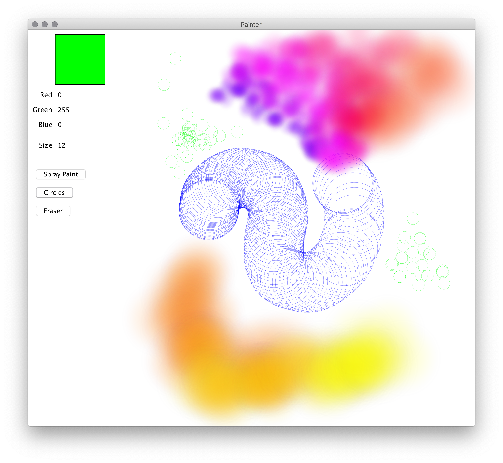

# Painter App

In this lab, we are practicing:

- **Event handling**: using button and mouse events to build an interactive application.
- **Refactoring**: changing the design of existing code without changing its functionality.
- **Iterative development**: building up complex software in small, testable steps, adjusting the structure of the code as we go.

In this lab, you build up a simple paint program.




## Step 0: Understand your starting point

You start with the following classes:

- `PainterApp`: The main class of the application.
- `BrushOptions`: A model object that contains parameters that control a brush.
- `PaintSettingsView`: A UI component that allows a user to choose different `BrushOptions`.
- `PaintUtils`: Helper functions for creating an airbrush / spray paint effect.

`PainterApp` is the only one of the existing classes you will modify in this lab.

You should understand the **API and general purpose** of the other classes, but you do **not** need to understand how they are implemented. (You are of course welcome to read through them! But don’t get bogged down in the details. Let abstraction do its job.)

Try running the code. You should see a user interface for choosing a color and brush size. You should also see a single fuzzy blue dot on the screen — but it just sits there doesn’t do anything.


## Step 1: Response to mouse events

Find the line in `PainterApp` that adds that single blue dot. (It is marked with a TODO.) Replace it with an `onMouseDown` event handler that calls `paint()` with the event’s position.

Run the code. The canvas should start blank, and you should be able to stamp dots on the screen by clicking. You should be able to change the color and size of the new dots using the controls on the left.

Now add a _second_ event handler that is identical to the first, except that it responds to **drag events** instead of mouse down events.

Run the code again, and you should be able to drag the mouse across the canvas to make a painting!

Test well, make sure it works properly, then ✅ commit your work.


## Interlude: Let’s plan!

Your main goal in this lab is to support multiple brushes. You currently have a spray paint effect; you will add two more.

The code is not yet ready for multiple brushes. You will get ready in two steps:

1. Extract a separate `Brush` class from `PainterApp` that is responsible for nothing but placing the fuzzy dots.
2. Convert that to a `SprayPaint` class that implements a `Brush` interface, and make `PainterApp` depend _only_ on the interface.


## Step 2: Extract `Brush` class

Let’s do just step 1. Keep in mind that for now, `Brush` will just be a class — not an interface!

Create a new `Brush` class with **no instance variables**, and just one method named `apply`:

```java
public class Brush {
    public void apply(...) {
        ...
    }
}
```

Add an instance variable called `currentBrush` to `PainterApp`. Initialize it with a new `Brush` object.

Now move some — but not all! — of the contents of the `PainterApp.paint()` method into `Brush.apply()`. Which parts should move? What parameters should `apply()` take? You need to figure this out. Guidelines:

- Any specifics about what the brush _does_ should be in the brush class. `PainterApp` will ask the brush to apply itself to the canvas without knowing anything about how the brush works.
- Any specifics about what UI components are on the screen should be in `PainterApp`. The brush should know it is applying itself to some canvas, but it should not know anything about specific UI components that are on the screen.
- Any information the brush needs to apply itself to the canvas, the `apply()` method should accept as a parameter. Again, `Brush` should have no instance variables.

Think about how to extract the class, and ask for tips if you are unsure.

Once this refactoring is done, you should still be able to paint exactly as before.

Test well, make sure it works properly, then ✅ commit your work.


## Step 3: Extract `Brush` interface

Now make `Brush` an interface with the `apply()` method, and `SprayPaint` the one class the implements it.

In `PainterApp`, the type of `currentBrush` should still be `Brush`, but now you initialize it with a new `SprayPaint` object:

```java
private Brush currentBrush = new SprayPaint();
```

Once this refactoring is done, everything should _still_ behave exactly as before. But now are ready for multiple kinds of brushes.

Test well, make sure it works properly, then ✅ commit your work.


## Step 4: Add a new brush

You will create a new implementation of `Brush` that draws thin unfilled circles on the screen. Be sure to respect the brush color and brush radius.

You are welcome to figure this out on your own if things are going super quickly and you want a challenge. If you are pressed for time, you are also welcome to [copy this implementation](https://gist.github.com/pcantrell/cf2106d0d734afd805c17fae63a2efcc) into your project.

Try making `PainterApp` use your new brush instead of the old one. You should be able to do this by doing _nothing at all_ except changing `new SprayPaint()` to `new CirclesBrush()` (or whatever you called the new brush class).

You should now see circles instead of the spray paint effect.

Test well, make sure it works properly, then ✅ commit your work.


## Step 5: Add the ability to switch brushes

In `PainterApp`, create a new method `addBrushButton(Brush brush, double y)` that does the following:

- Create a `Button` with the title “Change Brush”. (Make sure you have the`Button` from `comp127graphics`, and not a different `Button` class.)
- Position it at `10, y`.
- Add it to the canvas.
- Make it so that when the user clicks it, it sets `currentBrush` to this brush.

Add a new instance variable called `availableBrushes` that is `List` of `Brush` objects. Put one instance of each of your two brushes in the list.

In the constructor, loop over `availableBrushes` and call `addBrushButton()` for each one. (Be sure to pass different `y` coordinates so they aren’t all on top of each other.)

Run your code. You should see two “Change Brush” buttons. If you click one and then paint, you should see spray painting; if you click the other and then paint, you should see circles. Polymorphism unleashed!

Test well, make sure it works properly, then ✅ commit your work.


## Step 6: Add an eraser

Make a new implementation of `Brush` called `Eraser`.

`Eraser` should do the following:

- Call `canvas.getElementAt()` to get the graphics object at the given position.
- If that method did not return null, call `canvas.remove()` with the object you found.

This should take just a little bit of code.

Add `Eraser` to the end of `availableBrushes`, and try it out! You should be able to paint something, then switch to the eraser by clicking the appropriate button and erase parts of it. Yay!

But wait…. Try dragging the eraser over the brush buttons on the left of the screen. Oops.

That’s OK. This is progress! ✅ Commit your work, and then you can fix the bug.


# Step 7: Fix the eraser

The problem is that when you call `getElementAt()`, you remove _any_ element you find — including the buttons!

(Aside: note that the eraser does _not_ remove the color and brush size UI elements. Why not? They are not directly inside the canvas; they are all inside a `GraphicsGroup` inside the canvas — a child of a child of the canvas. The `getElementAt()` method will look inside groups, but the `remove()` method only allow you to remove immediate children. So the canvas says, “Sorry, I don’t have that element!” and nothing happens.)

One solution would be to try to look at the matched element and figure out whether it is part of the painting or part of the controls. But that would be a *brittle change*: we want to be able to add new kinds of controls and new kinds of brushes, without constantly having to worry about making sure the eraser identifies which is which.

A better solution is to put the entire painting inside a `GraphicsGroup`. That group will contain _only_ the painting and not the whole UI, so we can safely remove anything from it.

In `PainterApp`, add a new `GraphicsGroup` instance variable called `paintLayer`. In the constructor, initialize it and add it to the canvas:

```java
paintLayer = new GraphicsGroup();
canvas.add(paintLayer);
```

Now find the call to `currentBrush.apply()`, and change the `canvas` parameter to `paintLayer`.

Oops! This breaks! Why? Because `CanvasWindow` is not a `GraphicsGroup`. That means you need to change the `Brush` interface — and all the classes that implement it — so they take a `GraphicsGroup` instead of a canvas.

Once you have made that change, all the brushes will work entirely within `paintLayer`. You should still be able to paint and erase as before, but the eraser should no longer remove any buttons.

Test well, make sure it works properly, then ✅ commit your work.


# Step 8: Give the brushes names

You’re almost there! In this last step, you get a good feel for what iterative development really feels like in practice.

It’s annoying that all the buttons have the same name, isn’t it? Let’s give the different buttons different names.

Add a `getName()` method to the `Brush` interface.

Make each class that implements `Brush` implement that method by returning a different user-friendly string. (By “user friendly,” I mean for example that you should return `"Spray Paint"` with a space in it, so it sounds like something that is meaningful to an artist, not meaningful to a programmer.)

When you call the `Button` constructor, instead of passing `"Change Brush"`, pass the brush’s name.

Run the program. You should now have a UI with three buttons with different names.

Test well, make sure it works properly, and **enjoy your excellent work!** Then ✅ commit it.


# Bonus: Make additional brushes

You know you want to, right? Of course you do. Be inventive! Have fun!

Or, if you are overwhelmed, give yourself a breather. Maybe even make a painting.
